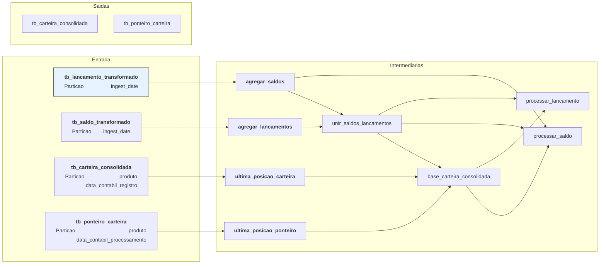

# hello this is a new documentation

Vamos considerar que a `<chave_conciliacao>` é o conjunto de campos abaixo:
- produto
- conta
- contrato
- tipo_empresa
- empresa
- departmaneto

## agregar_saldos

1. Só traz a linha com a maior `data_hora_evento` para cada `<chave_conciliacao>` + `data_contabil`
2. Soma o `valor_transacao` para cada  `id_dw6` + `<chave_conciliacao>` + `data_contabil` + `data_hora_evento`

Granularidade final: `id_dw6` + `<chave_conciliacao>` + `data_contabil` + `data_hora_evento`

## agregar_lancamentos

1. Separa o campo `valor_transacao` em dois campos: `debito` e `credito`
    - se `valor_transacao` > 0 => valor entra em `credito`
    - se `valor_transacao` < 0 => valor entra em `debito`
2. Soma os campos `debito` e `credito` para cada `<chave_conciliacao>` + data_contabil  + data_contabil_registro

Granularidade final: `<chave_conciliacao>` + data_contabil + data_contabil_registro

## unir_saldos_lancamentos

1. Une todos os contratos da tabela de lançamentos e saldos em uma tabela só
2. Todos os campos vem da tabela de lançamentos, **exceto** `data_hora_evento` e `saldo_informado`
    - se a `chave_conciliacao + data_contabil` não existir na tabela de saldos:
        - `data_hora_evento = 0000-00-00 00:00:00.00000`
        - `saldo_informado = 0`

Granularidade final:

## base_carteira_consolidada

1. Traz todos os contratos das tabelas de entrada: `tb_saldo_transformado` e `tb_lancamento_transformado` e:
    - se o `contrato+data_contabil` não existe na tabela de entrada `tb_carteira_consolidada`, pegamos os campos `saldo_informado`, `saldo_calculado` e `data_hora_evento` da tabela ponteiro
    - se o `contrato+data_contabil` **existem** na tabela de entrada `tb_carteira_consolidada`, pegamos os valores históricos da `tb_carteira_consolidada`
        - porém só consideramos os `contratos+data_contabil` >= do que existem nas tabelas de entrada `tb_saldo_transformado` e `tb_lancamento_transformado` (ou seja, se na tabela `tb_carteira_consolidada` existir uma linha com `contrato=11111 e data_contabil=2025-01-01` mas nas tabelas de entrada de lançamento e saldo a menor data_contabil para o contrato=11111 for `data_contabil=2025-01-03 não trazemos essa linha
    - não traz os contratos da carteira consolidada e da ponteiro que **não** existem nas tabelas de saldo e lançamento 

## processar_saldo

1. Left join entre `base_carteira_consolidada` e `unir_saldos_lancamentos` usando a chave `chave_conciliacao+data_contabil`
    - Atualiza o campo `saldo_informado` e `data_hora_evento` com os valores das tabelas onde o campo `data_hora_evento` é mais atualizado
    -   para cada `chave_conciliacao + data_contabil`, se o campo `data_hora_evento` da tabela `unir_saldos_lancamentos` > `base_carteira_consolidada`, pegamos o `data_hora_evento` da tabela` `unir_saldos_lancamentos`
2. Inner join da tabela de cima com a `agregar_saldos` usando a `chave_conciliacao + data_contabil` como chave
    -  Filtra todos os contratos da tabela `2.` que nao tem evento de saldo (`data_hora_evento = 0000-00-00 00:00:00.00000`) e a `data_contabil` da tabela acima > `data_contabil` da tabela `agregar_saldos`
    - para cada `chave_conciliacao+data_contabil` traz a maior `data_contabil`
4. Atualiza o campo `saldo_informado` da tabela `1.`
    - para cada `chave_conciliacao + data_contabil` da tabela `2.`, trazer o saldo da tabela `agregar_saldos`
    - se não acharmos o saldo, mantemos o `saldo_informado` que tínhamos antes

pq temos essa etapa? a tabela unir_saldos_lancamentos em teoria ja teria todos os saldos `agregar_saldos`

## processar_lancamento

Re-calcula os campos: `debito`, `credito` e `total_lancamento` de acordo com os lancamentos da entrada + histórico

## unir_saldos_lancamentos_base_carteira_consolidada

---
config:
  look: handDrawn
  theme: base
---

