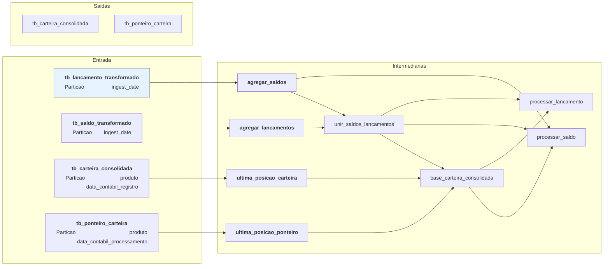

# hello this is a new documentation

Vamos considerar que a `<chave_conciliacao>` é o conjunto de campos abaixo:
- produto
- conta
- contrato
- tipo_empresa
- empresa
- departmaneto

## agregar_saldos

1. Só traz a linha com a maior `data_hora_evento` para cada `<chave_conciliacao>` + `data_contabil`
2. Soma o `valor_transacao` para cada  `id_dw6` + `<chave_conciliacao>` + `data_contabil` + `data_hora_evento`

Granularidade final: `id_dw6` + `<chave_conciliacao>` + `data_contabil` + `data_hora_evento`

## agregar_lancamentos

1. Separa o campo `valor_transacao` em dois campos: `debito` e `credito`
    - se `valor_transacao` > 0 => valor entra em `credito`
    - se `valor_transacao` < 0 => valor entra em `debito`
2. Soma os campos `debito` e `credito` para cada `<chave_conciliacao>` + data_contabil  + data_contabil_registro

Granularidade final: `<chave_conciliacao>` + data_contabil + data_contabil_registro

## unir_saldos_lancamentos

1. Une todos os contratos da tabela `agregar_saldos` e `agregar_lancamentos` em uma tabela só
2. Todos os campos vem da tabela `agregar_lancamentos`, **exceto** `data_hora_evento` e `saldo_informado`
    - se a `chave_conciliacao + data_contabil` não existir na tabela de saldos:
        - `data_hora_evento = 0000-00-00 00:00:00.00000`
        - `saldo_informado = 0`

Granularidade final:

## base_carteira_consolidada

1. Traz todos os contratos das tabelas `unir_saldos_lancamentos`:
    - se as `chave_conciliacao+data_contabil` não existe na tabela `ultima_posicao_consolidada`, pegamos os campos `saldo_informado`, `saldo_calculado` e `data_hora_evento` da tabela `ultima_posicao_ponteiro`
    - se as `chave_conciliacao+data_contabil` **existem** na tabela de entrada `ultima_posicao_carteira_consolidada`, pegamos os valores históricos da `ultima_posicao_carteira_consolidada`
        - porém só consideramos as `chaves_conciliacao` onde a `data_contabil` >= `data_contabil da unir_saldos_lancamentos` 
        - ou seja, se na tabela `ultima_posicao_carteira_consolidada` existir uma linha com `contrato=11111 e data_contabil=2025-01-01` mas nas tabelas `unir_saldos_lancamentos` a menor data_contabil para o contrato=11111 for `data_contabil=2025-01-03 não trazemos essa linha
    - não atualizamos os contratos que **não** existem nas tabela `unir_saldos_lancamentos`

## processar_saldo

1. Atualiza os campos `saldo_informado` e `data_hora_evento` de acordo com os valores do histórico `base_carteira_consolidada` + entrada `unir_saldos_lancamentos`
    - só atualizamos os campos se a `data_hora_evento` for mais recente do que a gravada no histórico

## processar_lancamento

Re-calcula os campos: `debito`, `credito` e `total_lancamento` de acordo com os valores do histórico `base_carteira_consolidada` + entrada `unir_saldos_lancamentos`

## unir_saldos_lancamentos_base_carteira_consolidada

---
config:
  look: handDrawn
  theme: base
---

